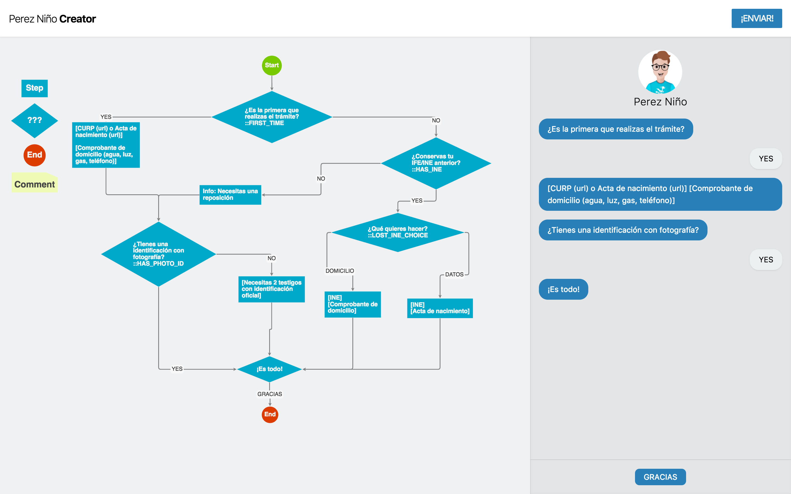

# Perez Niño

Este es el repo del Editor de flujos para la app Perez Niño. Url de desarrollo [http://ssh.javier.xyz:8123/](http://ssh.javier.xyz:8123/).

[](http://ssh.javier.xyz:8123/)

# ¿Cómo participar creando flujos?
* Abre la app de edición [http://ssh.javier.xyz:8123/](http://ssh.javier.xyz:8123/) y crea un diagrama de flujo con el trámite que quieres resolver.
	* Si quieres saber más de diagramas de flujo [https://es.wikipedia.org/wiki/Diagrama_de_flujo](https://es.wikipedia.org/wiki/Diagrama_de_flujo).
* Prueba tu flujo usando el chat del lado derecho de la app.
* Click en [enviar], se abrirá un formulario de correo con un código.
* En el correo, aparte del código, mándanos la fuente de tu información.
* Nosotros probaremos el flujo y te haremos saber cuando esté publicado o si tenemos preguntas, *¡muchas gracias!*

## ¿Quieres participar desarrollando?

Woot! Gracias! La app está hecha en Vuejs, estas son las instrucciones para echar a andar el ambiente de desarrollo:

Si quieres saber más del backend: [https://github.com/Holowaychitos/pereznino-backend](https://github.com/Holowaychitos/pereznino-backend)

``` bash
# install dependencies
npm install

# serve with hot reload at localhost:8080
npm run dev

# build for production with minification
npm run build

# run the flowchart server
cd ext/gojsweb python -m SimpleHTTPServer 8005
```
